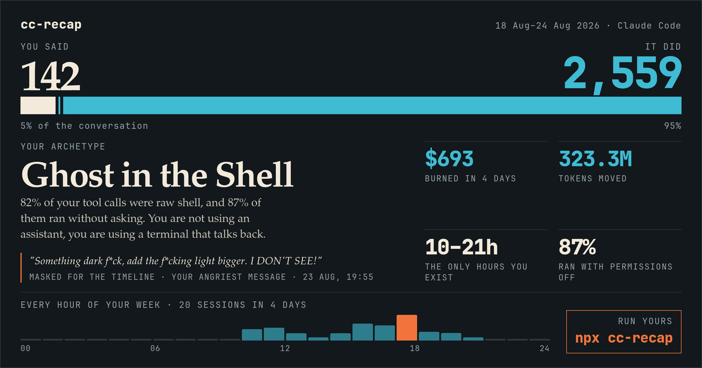

<h1 align="center">cc-recap</h1>

<p align="center">
  <b>Spotify Wrapped for Claude Code.</b><br>
  One command. Reads the transcripts Claude Code already wrote, computes everything
  on your machine, uploads nothing.
</p>

<p align="center">
  <code>npx cc-recap</code>
</p>

<p align="center">
  
</p>

<p align="center">
  <i>It tells you which of you two wrote more, what your worst hour is, and what
  it actually cost. Then it hands you that card as a PNG.</i>
</p>

---

## Install

```
npx cc-recap                     # no install, last 7 days
npm install -g cc-recap          # then just: cc-recap
```

Zero dependencies, Node 18+. The report is written to `./cc-recap.html` — a single
self-contained file with inline CSS and JS and no network requests. Open it in a browser,
or pass `--open` and let it open itself.

## Run it

```
cc-recap                         # last 7 days -> ./cc-recap.html
cc-recap --days 30 --open
cc-recap --all --json recap.json
cc-recap --from 2026-08-01 --to 2026-08-07 --out august.html
```

| Option | Meaning |
|---|---|
| `--days N` | window length counted back from today (default 7) |
| `--from DATE` / `--to DATE` | explicit window, `YYYY-MM-DD`, local midnight boundaries |
| `--all` | every transcript on the machine |
| `--out FILE` | output path (default `./cc-recap.html`) |
| `--json FILE` | also dump the raw report object |
| `--artifact` | emit a body-only file for the Claude Code Artifact tool |
| `--projects DIR` | transcripts root (default `~/.claude/projects`) |
| `--prices FILE` | JSON price overrides |
| `--open` | open the report in your browser |
| `--quiet` | no terminal summary |
| `--version` | print the version |

## The card

The top of the report is a 1200 × 630 card — archetype, what you said versus what it
did, spend, the hours you exist in, and the ratio of lines written to lines kept.
Three buttons sit above it:

- **Download PNG** — the card at 2400 × 1260, rendered from the live page, no crop, no scrollbar.
- **Share on X** — opens a post pre-filled with your numbers and saves the PNG to drag in.
- **Safe mode** — replaces the middle of each swear word with asterisks and leaves the sentence intact, so
  the card reads as something a person said and still goes up under your real name.

The card carries `npx cc-recap` on it, which is the entire distribution strategy.

## Use it as a library

```js
import { collect } from "cc-recap/collect";
import { analyze } from "cc-recap";
import { renderPage } from "cc-recap/render";

const report = analyze(collect({ from: Date.parse("2026-08-01"), to: Date.now() }));
console.log(report.money.billed, report.rage.meter);
```

## Where the numbers come from

Everything is read out of `~/.claude/projects/**/*.jsonl` — the transcripts Claude Code
already writes. Subagent transcripts (`<session>/subagents/*.jsonl`) count as real work.

| Figure | Source field |
|---|---|
| Cost, cache economics | `message.usage.{input_tokens,output_tokens,cache_creation_input_tokens,cache_read_input_tokens}` |
| Cache TTL pricing | `usage.cache_creation.{ephemeral_1h_input_tokens,ephemeral_5m_input_tokens}` |
| Hidden thinking | `usage.output_tokens_details.thinking_tokens` — billed as output, returned empty |
| Model split | `message.model` per turn |
| Lines of code | `toolUseResult.structuredPatch` — real diffs, plus whole-file `create` results |
| Tool use and errors | `tool_use` blocks and `tool_result.is_error`, linked by `tool_use_id` |
| Instructions | user messages, minus tool results, `isMeta`, and slash-command envelopes |
| Typed vs scripted | `promptSource === "typed"` / `origin.kind === "human"` |
| Permission posture | `permissionMode` carried on each prompt |
| Rhythm | `timestamp` on every kept record, rendered in local time |
| Projects | `cwd`, falling back to the flattened transcript directory name |

## How the derived metrics are defined

**Money.** List prices per million tokens (`src/pricing.mjs`), cache reads at `0.1×` the
input price, cache writes at `2×` for the 1-hour TTL and `1.25×` for 5 minutes. *Without
caching* re-prices the exact same traffic with every cached token billed as fresh input —
the gap is what the cache is worth. These are API list prices: on a Pro/Max subscription
they are the value of what you used, not a bill you received. Override with `--prices`.

**Work.** Lines added and removed come from diffs, never from counting Edit calls. *Net
survivors* is added − removed, and the headline ratio is added ÷ net: how many lines were
written per line that survived.

**Announcements vs actions.** A message that announces the next action ("I'll…", "сейчас…")
counts as a stated intention; it counts as acted on when a tool call follows in the same
session before the human speaks again.

**Vocabulary.** Distinctive, not frequent: words one side used at least twice and the other
never used at all. Fenced and inline code is stripped first.

**Rage.** Weighted per message — annoyance ×1, profanity ×3, insult ×6, and ×1.5 again when
the anger is pointed at the agent rather than the code; two or more shouted words add 1.
Matching is obfuscation-tolerant: Latin lookalikes fold to Cyrillic, masking characters are
dropped, letter runs collapse, and letters spaced out to dodge a filter are closed up, so
`б л я`, `6ля` and `бл*` all land on the same stem. The meter saturates at a weighted score
of 2 per instruction. It never leaves this machine. Lookalike folding applies only inside a
word that already contains Cyrillic, so an English word is matched as itself rather than
being folded into mixed script.

**Language.** Every phrase pattern is bilingual (EN + RU). Note that JavaScript's `\b` is
ASCII-only and silently never matches around Cyrillic — every pattern here spells its word
boundaries out with Unicode lookarounds instead.

## Layout

```
wrapped.mjs        CLI: parse args, pick the window, write the file
test/smoke.mjs     end-to-end check against a synthetic transcript (npm test)
docs/card.png      the card image the top of this README points at
src/collect.mjs    transcripts -> normalized corpus (turns, prompts, tools, edits, texts)
src/pricing.mjs    price table and the billed/uncached cost model
src/metrics.mjs    corpus -> report object (every number the page shows)
src/text.mjs       phrase mining, vocabulary, rage scoring
src/render.mjs     report -> self-contained HTML
src/style.css      the report's stylesheet
```

## Privacy

No network calls anywhere in the codebase. The only thing that leaves the process is the
file you asked for — which does quote your own angriest message back at you. **Safe mode**
on the card masks the rude words in that quote before you export the PNG — first and last
letter kept, everything between them replaced with asterisks — while the rest of the
sentence stays readable. The verbatim text stays in the Rage section, on your machine.

The two buttons that touch the outside world do so only when you click them: **Share on X**
opens a pre-filled compose window in a new tab (it does not post), and **Download PNG**
writes a file. Neither sends the report anywhere.
